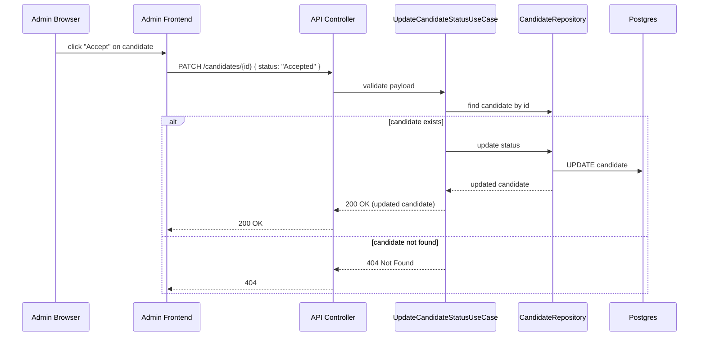

# Sequence Diagram: Admin Update (No Authentication)

Purpose: Shows the flow for an admin updating a candidate's status via a route without authentication (MVP).

Notes:
- This flow intentionally omits authentication; ensure teams understand security implications and add auth in a future iteration.
