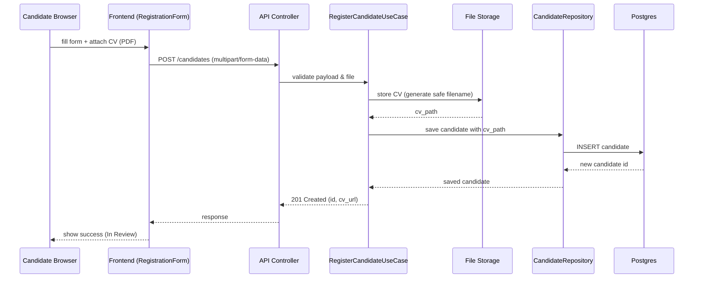

# Sequence Diagram: Candidate Registration

Purpose: Shows the happy path for a candidate submitting their details and uploading a CV.

Notes:
- File validation (PDF + size limit) occurs at API boundary and in the use-case.
- Errors (validation/file issues) map to standard error responses documented in `docs/validation.md`.
